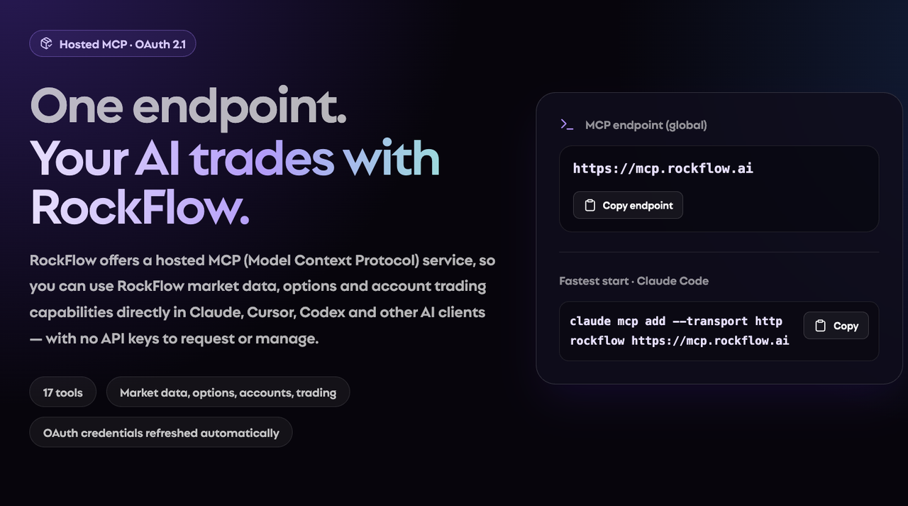
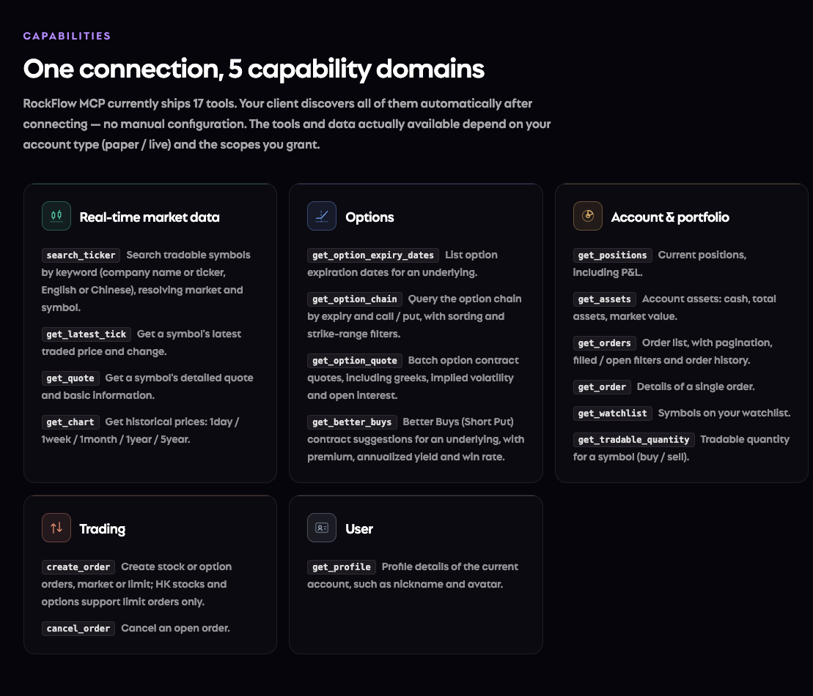

<p align="center">
  
</p>

<h1 align="center">RockFlow MCP</h1>

<p align="center">
  <b>One endpoint. Your AI trades with RockFlow.</b><br>
  Hosted MCP · OAuth 2.1 · 17 tools · No API keys to request or manage
</p>

<p align="center">
  English | <a href="README.zh-CN.md">简体中文</a>
</p>

---

RockFlow offers a hosted MCP (Model Context Protocol) service, so you can use RockFlow market data, options and account trading capabilities directly in Claude, Cursor, Codex and other AI clients — with no API keys to request or manage.



## MCP Endpoint

| Region | Endpoint |
|---|---|
| Global | `https://mcp.rockflow.ai` |

**Fastest start (Claude Code):**

```bash
claude mcp add --transport http rockflow https://mcp.rockflow.ai
```

## Capabilities

RockFlow MCP currently ships 17 tools across 5 capability domains. Your client discovers all of them automatically after connecting — no manual configuration.



| Domain | Coverage |
|---|---|
| Real-time market data | Symbol search, latest tick, detailed quotes, historical charts |
| Options | Expiry dates, option chain, contract quotes (greeks, IV, open interest), Better Buys suggestions |
| Account & portfolio | Assets, positions, orders, watchlist |
| Trading | Stock & option orders, order cancellation, tradable quantity |
| User | Account profile |

The tools and data actually available depend on your account type (paper / live) and the scopes you grant.

<!-- TODO: confirm supported markets (US / HK) and market-data terms (real-time vs. delayed, whether it differs by account type) — should be stated explicitly here. -->

## Tools

### Real-time market data

| Tool | Description |
|---|---|
| `search_ticker` | Search tradable symbols by keyword (company name or ticker, English or Chinese), resolving market and symbol |
| `get_latest_tick` | Get a symbol's latest traded price and change |
| `get_quote` | Get a symbol's detailed quote and basic information |
| `get_chart` | Get historical prices: `1day` / `1week` / `1month` / `1year` / `5year` |

### Options

| Tool | Description |
|---|---|
| `get_option_expiry_dates` | List option expiration dates for an underlying |
| `get_option_chain` | Query the option chain by expiry and call / put, with sorting and strike-range filters |
| `get_option_quote` | Batch option contract quotes, including greeks, implied volatility and open interest |
| `get_better_buys` | Better Buys (Short Put) contract suggestions for an underlying, with premium, annualized yield and win rate |

### Account & portfolio

| Tool | Description |
|---|---|
| `get_positions` | Current positions, including P&L |
| `get_assets` | Account assets: cash, total assets, market value |
| `get_orders` | Order list, with pagination, filled / open filters and order history |
| `get_order` | Details of a single order |
| `get_watchlist` | Symbols on your watchlist |
| `get_tradable_quantity` | Tradable quantity for a symbol (buy / sell) |

### Trading

| Tool | Description |
|---|---|
| `create_order` | Create stock or option orders, market or limit; HK stocks and options support limit orders only |
| `cancel_order` | Cancel an open order |

### User

| Tool | Description |
|---|---|
| `get_profile` | Profile details of the current account, such as nickname and avatar |

## Paper vs. Live

During OAuth authorization you choose whether to authorize a **paper** or a **live** account:

- **Paper** — virtual funds only, no real assets involved. A paper account is created automatically on authorization, no separate application needed. Best for first-time trial and testing.
- **Live** — operations affect real account assets.

## Prerequisites

- A RockFlow account. Paper trading does not require a fully opened brokerage account — a RockFlow ID is enough.
- An AI client that supports the MCP OAuth 2.1 standard (see [Client compatibility](#client-compatibility) below).

## Client Setup

> Configuration formats below may change across client versions — always defer to the client's official documentation.

### Claude Code

Run in your terminal:

```bash
claude mcp add --transport http rockflow https://mcp.rockflow.ai
```

Then inside the `claude` terminal UI, type `/mcp`, select **rockflow**, choose **Authenticate**, and follow the OAuth flow.

### Claude Web (claude.ai)

1. Open claude.ai and go to **Settings → Connectors**
2. Click **Add** in the top-right corner and choose **Add custom connector**
3. Enter `rockflow` as the name and `https://mcp.rockflow.ai` as the URL, then click **Add**
4. Complete the OAuth authorization when prompted


### Codex

Run in your terminal:

```bash
codex mcp add rockflow --url https://mcp.rockflow.ai
```

Then complete the OAuth authorization flow when Codex prompts you.

### Codex Desktop

1. Click **Settings → MCP Servers → Add Server** in the bottom-right corner
2. In the "Connect to a custom MCP" dialog, enter: Name `rockflow`, type **Streamable HTTP**, URL `https://mcp.rockflow.ai`; leave the other fields empty
3. Click **Save**
4. Back in the MCP Servers list, click **Authenticate** on the `rockflow` entry to complete OAuth

### Cursor

**Settings → MCP Servers → Add Remote MCP Server**, then enter the endpoint above.

### Grok

1. Open Grok Connectors: in the left sidebar, go to **Skills and Connectors → Connectors → New Connector → Custom**
2. Enter: Name `rockflow`, Server URL `https://mcp.rockflow.ai`
3. Click **Add Connector** and follow the RockFlow OAuth flow


### Other clients

Any AI client that fully implements the MCP OAuth 2.1 standard can generally connect via its "add custom MCP server / connector" flow — just enter the endpoint above. Check the client's official documentation for the exact entry point.

## OAuth Flow

RockFlow MCP uses standard OAuth 2.1 authorization. You never hand an API key or token to your client. In most MCP clients, authorization is triggered by the first tool call and completed in the browser:

1. **Initiate** — after adding the RockFlow MCP configuration, the first call triggers authorization
2. **Browser redirect** — the client opens a browser to the RockFlow login and consent page
3. **Log in & authorize** — sign in with your RockFlow account, choose paper or live, and approve the requested scopes
4. **Session established** — the client receives credentials and MCP tools become available
5. **Credential upkeep** — credentials refresh automatically per OAuth policy

<!-- TODO: where to review and revoke authorized AI clients (Longbridge puts this on the account security settings page) — must-answer for public docs. -->

## Client Compatibility

RockFlow MCP relies on the MCP OAuth 2.1 standard. Clients that don't fully implement the protocol will fail to authorize. If a connection fails, upgrade the client to the latest version first and check its MCP support documentation.

RockFlow MCP currently offers no authorization path outside the browser — use a client that can open a browser to complete OAuth.

## Security Recommendations

- **Paper first** — authorize a paper account for your first sessions; move to live only after you're familiar with how the tools behave.
- **Trade confirmation** — for order placement and cancellation, add an explicit instruction in your prompt requiring human confirmation before execution.
- **Credential hygiene** — OAuth credentials are managed by the client; don't copy them into untrusted environments.
- **Regular review** — periodically review and revoke authorizations you no longer use. <!-- TODO: revocation entry point, same source as above. -->

## Recommended Usage

- **Start with read-only queries.** Once authorized, all tools are available — there is no separate read-only vs. trading permission. Get familiar with low-risk tools (quotes, positions) before placing trades.
- **Put constraints in your prompt.** For example: "no single trade above X" or "confirm with me before executing".

## FAQ

**OAuth login fails**

- Confirm your RockFlow account is in good standing and required identity verification is complete
- Remove the existing configuration in your client, re-add it, and start authorization again

**Tools return `AUTH_REQUIRED`**

Authorization hasn't completed or has expired. Re-run the OAuth authorization in your client and retry.

**Is the MCP service paid?**

No — RockFlow MCP is currently free to use.

## Feedback

RockFlow MCP is under active iteration — issues and suggestions are welcome through any of the channels below:

- **Email**: [support@rockflow.ai](mailto:support@rockflow.ai)
- **X (Twitter)**: [@RockflowEnglish](https://x.com/RockflowEnglish)
- **LinkedIn**: [RockFlow](https://www.linkedin.com/company/rockflowapp)

---

<p align="center">
  <sub>RockFlow — next-generation AI investing. Also check out <a href="https://bobby.ai/">Bobby AI</a>, RockFlow's AI investment assistant.</sub>
</p>
