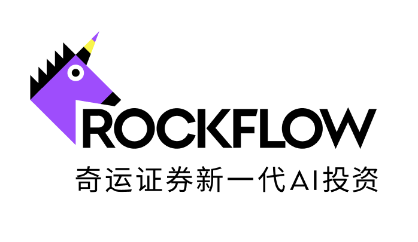
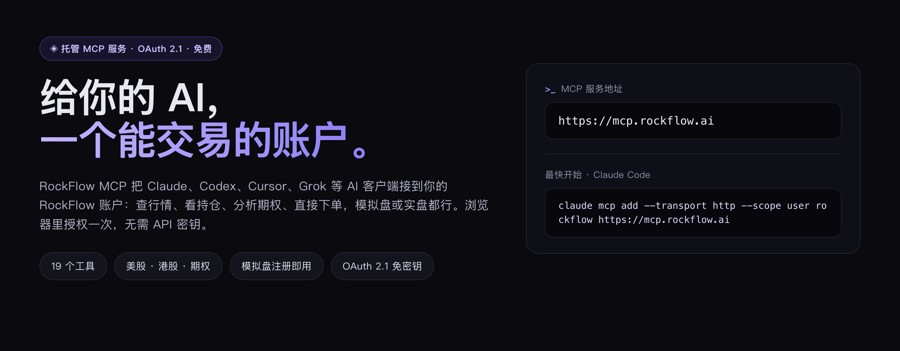
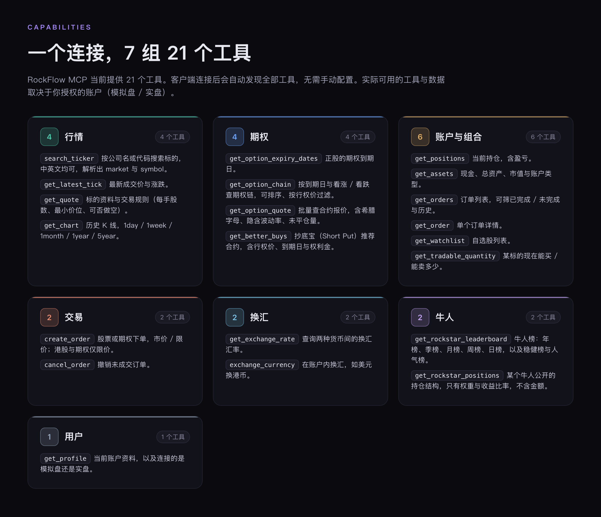
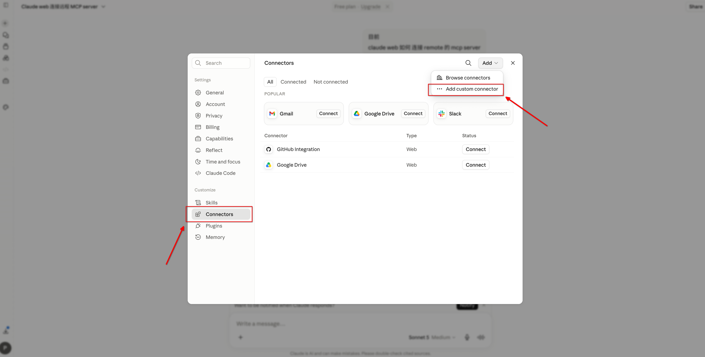
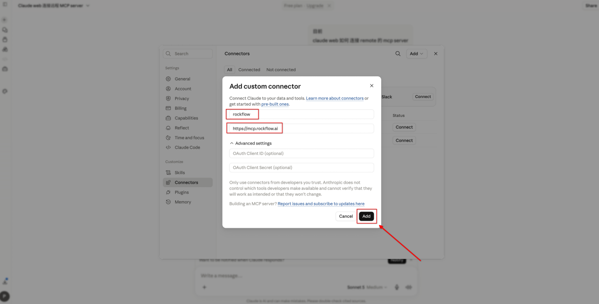
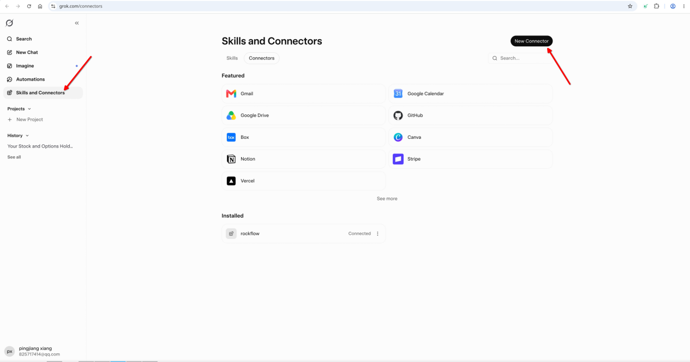
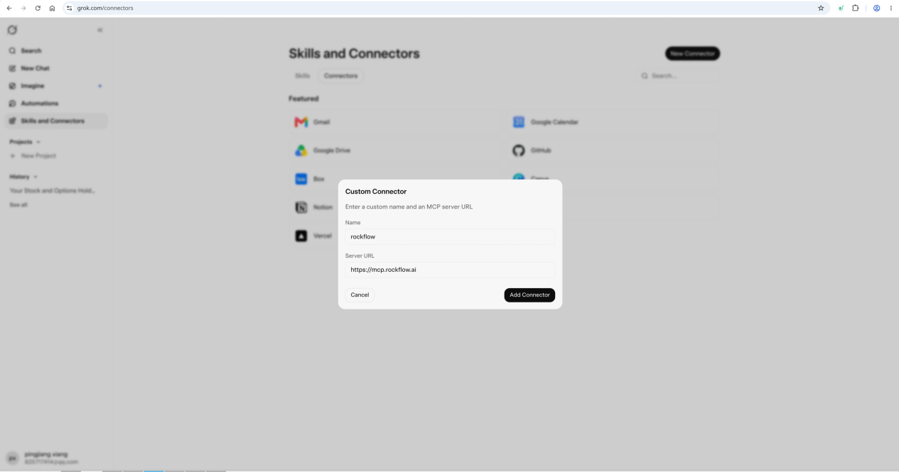

<p align="center">
  
</p>

<h1 align="center">RockFlow MCP</h1>

<p align="center">
  <b>一个地址，让 AI 直接用上 RockFlow。</b><br>
  托管 MCP · OAuth 2.1 · 17 个工具 · 无需申请或管理 API 密钥
</p>

<p align="center">
  <a href="README.md">English</a> | 简体中文
</p>

---

[RockFlow](https://rockflow.ai/mcp?utm_source=github&utm_campaign=MCP&utm_content=001) 提供托管的 MCP（Model Context Protocol）服务，让你在 Claude、Cursor、Codex 等 AI 客户端中直接使用 RockFlow 的行情、期权与账户交易能力，无需申请或管理 API 密钥。



## MCP 服务地址

| 区域 | 地址 |
|---|---|
| 全球 | `https://mcp.rockflow.ai` |

**最快开始方式（Claude Code）：**

```bash
claude mcp add --transport http rockflow https://mcp.rockflow.ai
```

## 可用能力

RockFlow MCP 当前提供 17 个工具，覆盖五大能力域。客户端连接后会自动发现全部工具，无需手动配置。



| 能力 | 覆盖范围 |
|---|---|
| 实时行情 | 标的搜索、最新成交价、详细报价、历史 K 线 |
| 期权 | 到期日列表、期权链、合约报价（希腊字母、隐含波动率、未平仓量）、抄底宝推荐 |
| 账户与组合 | 资产、持仓、订单查询、自选股 |
| 交易 | 股票与期权下单、撤单、可交易数量查询 |
| 用户 | 账户资料 |

实际可用工具与数据范围因账户类型（模拟盘 / 实盘）与授权范围而异。

<!-- 待确认：支持的市场范围（美股 / 港股）与行情数据口径（实时或延迟、是否区分账户类型），建议在此处明示。 -->

## 可用工具

### 行情

| 工具 | 说明 |
|---|---|
| `search_ticker` | 按关键词（公司名 / 代码，中英文均可）搜索可交易标的，解析出 market 与 symbol |
| `get_latest_tick` | 查询标的最新成交价与涨跌情况 |
| `get_quote` | 查询标的详细报价与基础信息 |
| `get_chart` | 查询标的历史行情（支持 `1day` / `1week` / `1month` / `1year` / `5year`） |

### 期权

| 工具 | 说明 |
|---|---|
| `get_option_expiry_dates` | 查询正股的期权到期日列表 |
| `get_option_chain` | 按到期日与看涨 / 看跌查询期权链，支持排序与行权价区间过滤 |
| `get_option_quote` | 批量查询期权合约报价（含希腊字母、隐含波动率、未平仓量等） |
| `get_better_buys` | 查询正股的抄底宝（Short Put）推荐合约，含权利金、年化收益率、胜率等 |

### 账户与组合

| 工具 | 说明 |
|---|---|
| `get_positions` | 查询当前持仓列表（含盈亏） |
| `get_assets` | 查询账户资产（现金、总资产、市值等） |
| `get_orders` | 查询订单列表，支持分页、已完成 / 未完成筛选与历史订单 |
| `get_order` | 查询单个订单详情 |
| `get_watchlist` | 查询自选股（关注列表）中的标的 |
| `get_tradable_quantity` | 查询某标的的可交易数量（买入 / 卖出） |

### 交易

| 工具 | 说明 |
|---|---|
| `create_order` | 创建交易订单，支持股票 / 期权、市价 / 限价（港股与期权仅支持限价单） |
| `cancel_order` | 撤销未成交订单 |

### 用户

| 工具 | 说明 |
|---|---|
| `get_profile` | 查询当前账户的用户资料（昵称、头像等） |

## 模拟盘与实盘

OAuth 授权过程中可以选择授权模拟盘或实盘账户：

- **模拟盘** — 使用虚拟资金，不涉及真实资产。授权后自动创建模拟账户，无需额外申请，适合首次体验与测试。
- **实盘** — 操作影响真实账户资产。

## 前置条件

- 已拥有 [RockFlow 账户](https://rockflow.ai/mcp?utm_source=github&utm_campaign=MCP&utm_content=001)；使用模拟盘不要求完成开户，注册 RockFlow ID 即可。
- 使用支持 MCP OAuth 2.1 标准的 AI 客户端（见下方[客户端兼容性](#客户端兼容性)）。

## 客户端接入

> 以下客户端的配置格式可能随版本变更，请以客户端官方文档为准。

### Claude Code

在终端运行以下命令：

```bash
claude mcp add --transport http rockflow https://mcp.rockflow.ai
```

然后进入 `claude` 终端界面，输入 `/mcp`，选择 **rockflow**，再选择 **Authenticate**，跟随流程完成 OAuth 授权。

### Claude 网页版（claude.ai）

1. 打开 claude.ai，进入 **Settings → Connectors**
2. 点击右上角 **Add**，选择 **Add custom connector**
3. 名称填写 `rockflow`，URL 填写 `https://mcp.rockflow.ai`，点击 **Add** 完成添加
4. 按提示完成 OAuth 授权





### Codex

在终端运行以下命令：

```bash
codex mcp add rockflow --url https://mcp.rockflow.ai
```

随后在 Codex 中按提示完成 OAuth 授权流程。

### Codex Desktop

1. 点击右下角 **Settings → MCP Servers → Add Server**
2. 在 "Connect to a custom MCP" 界面填写：Name 为 `rockflow`，类型为 **Streamable HTTP**，URL 为 `https://mcp.rockflow.ai`，其他字段留空
3. 点击 **Save**
4. 回到 MCP Servers 列表，点击 `rockflow` 条目上的 **Authenticate** 完成 OAuth 授权

### Cursor

**Settings → MCP Servers → 添加 Remote MCP Server**，填入上方服务地址即可。

### Grok

1. 打开 Grok Connectors，在左侧边栏选择 **Skills and Connectors → Connectors → New Connector → Custom**
2. 填写：Name 为 `rockflow`，Server URL 为 `https://mcp.rockflow.ai`
3. 点击 **Add Connector**，跟随 RockFlow OAuth 授权流程完成添加





### 其他客户端

其他支持 MCP OAuth 2.1 标准的 AI 客户端，一般也可以通过「添加自定义 MCP Server / Connector」的方式接入，填入上方服务地址即可，具体配置入口以客户端官方文档为准。

## OAuth 授权流程

RockFlow MCP 使用标准 OAuth 2.1 授权，你无需向客户端提供 API 密钥或 Token。在多数 MCP 客户端中，授权由首次工具调用触发浏览器完成：

1. **发起连接** — 在客户端添加 RockFlow MCP 配置后，首次调用会触发授权
2. **浏览器跳转** — 客户端自动打开浏览器，进入 RockFlow 登录与权限确认页
3. **登录并授权** — 使用 RockFlow 账户登录，选择授权模拟盘或实盘，并同意所请求的权限范围
4. **建立会话** — 授权完成后，客户端获得凭证，MCP 工具即可使用
5. **凭证维护** — 凭证按 OAuth 策略自动刷新

<!-- 待补充：撤销授权的入口——用户在哪里查看并撤销已授权的 AI 客户端（长桥为账户安全设置页），对外文档必答项。 -->

## 客户端兼容性

RockFlow MCP 依赖 MCP OAuth 2.1 标准。若客户端未完整实现该协议，将无法完成授权。如遇连接失败，请先升级客户端至最新版本，并查阅其 MCP 支持文档。

RockFlow MCP 目前不提供浏览器之外的替代授权方式；请使用能够正常拉起浏览器完成 OAuth 授权的客户端。

## 安全建议

- **模拟盘优先** — 首次使用建议授权模拟盘，熟悉工具行为后再考虑实盘。
- **交易确认** — 涉及下单、撤单等交易操作时，建议在 AI 提示词中明确要求执行前人工确认。
- **凭证安全** — OAuth 凭证由客户端管理，避免将其复制到不受信任的环境。
- **定期审查** — 定期检查并撤销不再使用的授权。<!-- 待补充：撤销入口，与上文同源。 -->

## 推荐使用方式

- **从查询类功能开始。** 授权后全部工具即开放使用，不区分只读与交易权限；建议先通过行情查询、持仓查看等低风险功能熟悉工具行为，再进行交易操作。
- **在提示词中加入约束。** 例如「每笔交易金额不超过 X」「执行前向我确认」等明确限制。

## 常见问题

**OAuth 登录失败**

- 确认 RockFlow 账户状态正常，已完成必要的身份验证
- 在客户端删除现有配置后重新添加并发起授权

**工具返回未授权（`AUTH_REQUIRED`）**

说明尚未完成授权或授权已过期，请在客户端重新发起 OAuth 授权后重试。

**使用 MCP 服务是否收费**

不收费，RockFlow MCP 服务目前免费使用。

## 反馈渠道

RockFlow MCP 处于持续迭代阶段，欢迎通过以下渠道反馈问题与建议：

- **邮箱**：[support@rockflow.ai](mailto:support@rockflow.ai)
- **X（推特）**：[@RockflowEnglish](https://x.com/RockflowEnglish)
- **领英**：[RockFlow](https://www.linkedin.com/company/rockflowapp)

---

<p align="center">
  <sub><a href="https://rockflow.ai/mcp?utm_source=github&utm_campaign=MCP&utm_content=001">RockFlow</a> — 新一代 AI 投资。也欢迎体验 RockFlow 旗下 AI 投资助理 <a href="https://rockflow.ai/mcp?utm_source=github&utm_campaign=MCP&utm_content=001">Bobby AI</a>。</sub>
</p>
